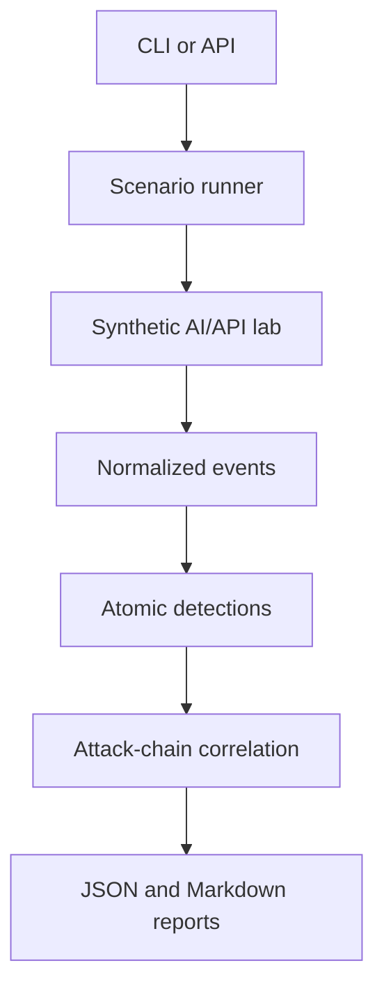

# Architecture

## Current vertical slice

## Trust boundaries

1. The user crosses into the control plane through the CLI or local API.
2. Scenario execution crosses into an isolated target boundary.
3. Target-generated telemetry crosses into the detection boundary.
4. Reports contain synthetic evidence only.

## Important design decision

The hero scenario uses a deterministic agent simulation instead of claiming
that a language model behaves identically on every run. This makes vulnerable
and secure control comparisons testable. Ollama will be added behind the same
tool-authorization boundary, and its variable output will be evaluated as a
separate experimental layer. The v0.3 Ollama adapter is loopback-only and
returns text only: model output cannot invoke a tool. Tool authorization will
remain a deterministic application decision when tool calling is introduced.

## Current attack chain

1. A synthetic poisoned document is uploaded.
2. Suspicious content is retrieved into agent context.
3. The simulated agent requests a sensitive document tool.
4. A user from tenant A attempts to read a tenant B document.
5. Vulnerable mode permits staging; secure mode blocks it.
6. The detector correlates retrieval, tool use, and authorization activity.

## What this MVP does not claim

- It is not a penetration-testing scanner.
- It does not execute malware or persistence.
- It does not yet use a production LLM.
- It does not prove that the example rules generalize to arbitrary systems.
- It does not yet calculate precision or recall; those require a labeled corpus.
