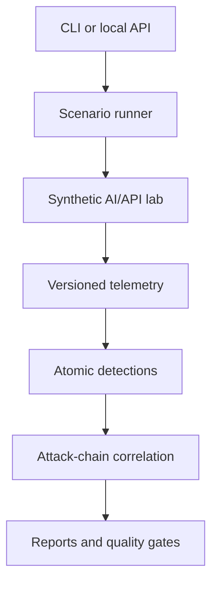

# Architecture

## Current vertical slice

## Trust boundaries

1. The user crosses into the control plane through the CLI or loopback API.
2. Scenario execution crosses into an isolated synthetic target boundary.
3. Untrusted retrieved content crosses into the agent-context boundary.
4. Tool requests cross a deterministic application-authorization boundary.
5. Target telemetry crosses into the detection and correlation boundary.
6. Reports contain synthetic evidence and explicit provenance.

## Security invariants

- Public targets are rejected; loopback is the default permitted boundary.
- Private container ranges require explicit configuration.
- Model-generated text cannot directly execute tools.
- Tenant authorization is an application decision, not a model decision.
- Tuned, adapted-regression, and untouched-holdout datasets are labeled separately.
- Detection and corpus fingerprints accompany reproducible evaluation output.

## Current attack chain

1. A synthetic poisoned document is uploaded.
2. Suspicious content is retrieved into agent context.
3. The simulated agent requests a sensitive document tool.
4. A tenant-A identity attempts to read a tenant-B document.
5. Vulnerable mode permits modeled staging; secure mode blocks it.
6. The detector correlates retrieval, tool-use, and authorization events.
7. The reporting layer records alerts, metrics, and provenance.

## Design decisions

The hero scenario uses deterministic agent simulation instead of claiming identical language-model
behavior across runs. This makes vulnerable and secure comparisons testable. The optional Ollama
adapter is loopback-only and returns text; tool authorization remains a deterministic application
decision.

Evaluation uses three distinct dataset roles:

- **tuning** for rule development;
- **adapted regression** for preventing known failures from returning;
- **untouched holdout** for measuring generalization without tuning against the first-run result.

## Current limitations

- This is not a penetration-testing scanner.
- It does not execute malware, persistence, or destructive payloads.
- The local-model path is experimental, not a production LLM gateway.
- Regex and normalization rules do not generalize to arbitrary semantic attacks.
- The holdout v1 recall of 0.3333 demonstrates a significant semantic-detection gap.
- The API is a local control plane and does not yet implement production identity or tenancy.
- PostgreSQL is provisioned for the roadmap but telemetry persistence is not yet complete.
